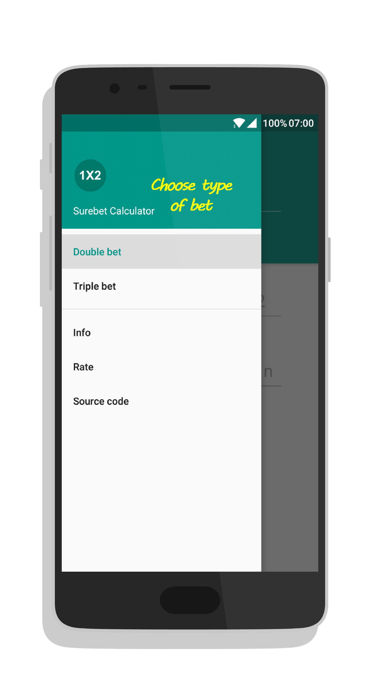
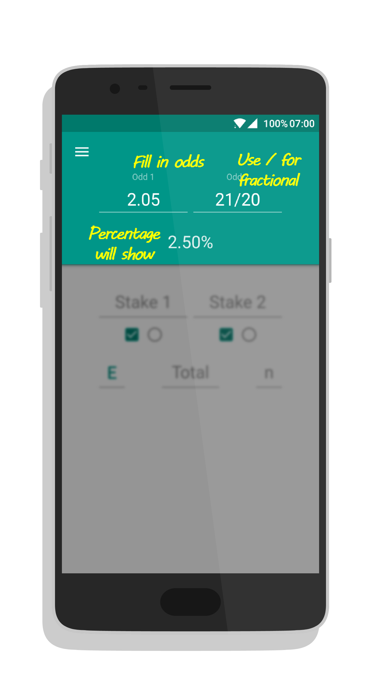
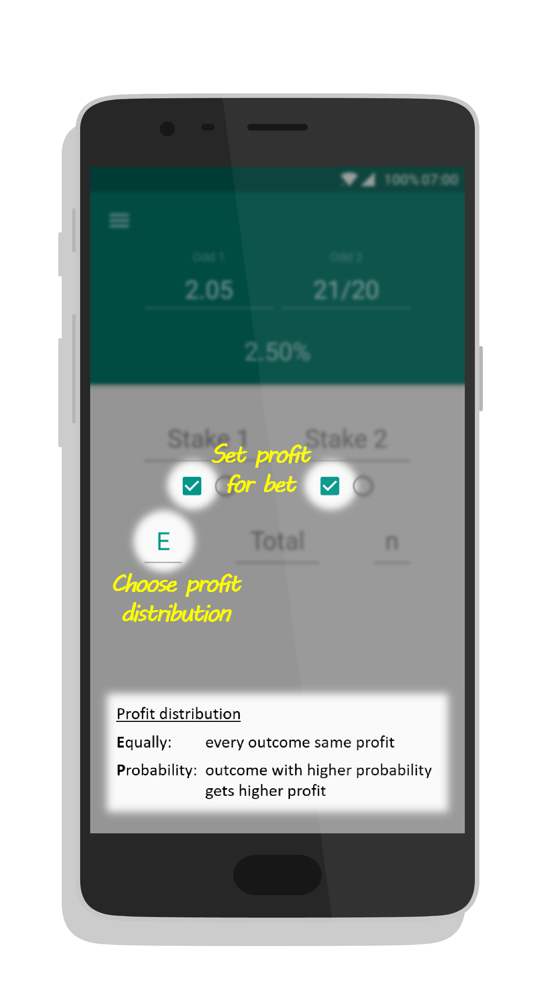
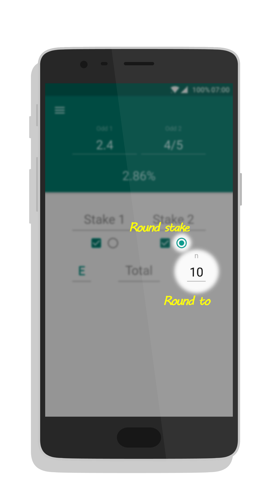
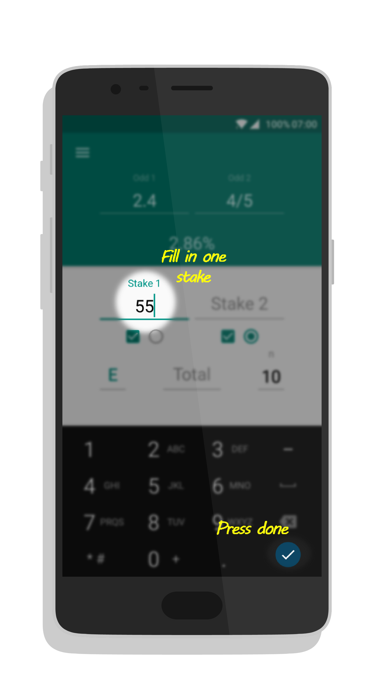
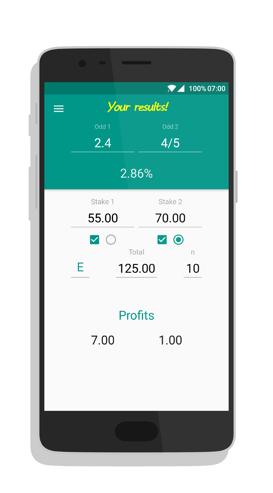

# How To Use

## Short visual explanation

_More extensive explanation down below_

  
  
 

## Extensive explanation

### Set type of bet

Surebet Calculator supports two kinds of bets: double and triple.
A double bet consists of 2 possible outcomes, while a triple consists of 3.
Keep in mind that these are **NON OVERLAPPING** bets, meaning that in every case only one of the outcomes comes true.
_This calculator does not support overlapping bets_.

Therefore, the first step is choosing the right type of bet. 
This can be done in the drawer menu, by pressing the hamburger icon in the top left and selecting either "Double bet" or "Triple bet".
The number of fields for odds and stakes will change accordingly.

### Fill in odds

The next step is to fill in the odds.
Odds can be entered either in decimal format by using a dot, or in fractional format by using a slash.
A combination of both formats in the same surebet is allowed.
The calculator will automatically show the percentage of the bet when the odds are filled in.
Negative percentage bets are also supported in this new version.

### Set profit distribution

One of the strengths of Surebet Calculator when compared to other arbing calculators, is the freedom to distribute your profit.
You can choose which outcomes get profit by (un)checking the square checkbox below the stake field.
Additionally, you can choose the distribution of profit between the selected outcomes.
There are 2 options:
* **E**qually: Distribute the profit equally. Each outcome will receive the same amount of profit.
* **P**robability: Distribute the profit according to probability. Outcomes with higher likelihood will get a larger amount of profit.

_Note that with a negative percentage bet, the loss is treated as a negative profit and distributed accordingly_.

### Set rounding

Another feature of Surebet Calculator is the possibility to request rounded stakes.
This can be done by checking the round checkbox below the stake field and filling in **n**.
All checked stakes will be rounded to the nearest multiple of **n**

_n should be an order of magnitude smaller than your stakes to give meaningful results_.  
_Rounding might change distribution of profit_.

### Fill in one (any) stake

Now all what's left is filling in one of the stakes and pressing action done (the check in the bottom right of your keyboard).
This can be either **Stake 1**, **Stake 2**, **Stake 3** or **Total**.
The calculator will do the rest.

### Your results

Finally, your results are shown.
All stake fields are filled in with the requested stakes, and the profits are shown down below.

Happy surebetting!
