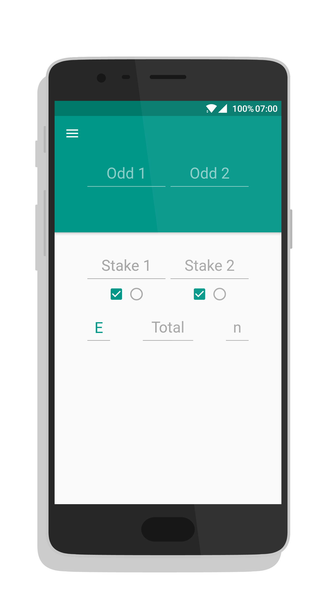
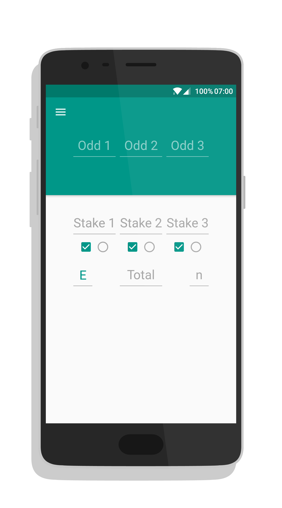
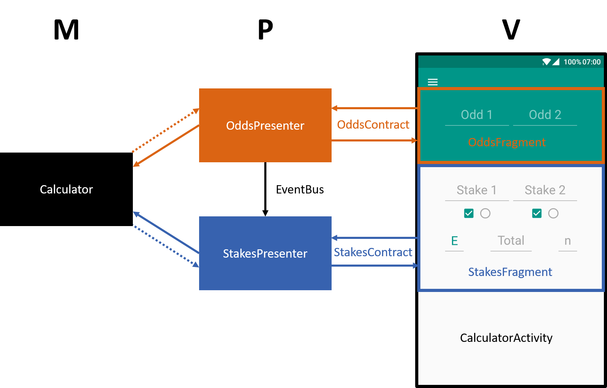

# Surebet Calculator MVP
Android app for calculating surebet stakes.

 

### Surebetting / Arbitrage Betting

First of all, it might be useful to understand what surebetting aka arbitrage betting is. 
Surebetting is a way to make constant profits in sports betting by betting on different outcomes of the same match at different bookmakers.
More info about the subject can be found [here](https://en.wikipedia.org/wiki/Arbitrage_betting).

### Surebet Calculator 2.0

Surebet Calculator 1.0 was the first app I ever put on the Google Play Store.
As one might expect from a first app, it was quite buggy and the implementation wasn't pretty.
Now, 3 years later, I have rebuilt the app from the ground up: Surebet Calculator 2.0.
The main reason for rebuilding the app was to practice the [MVP pattern](https://en.wikipedia.org/wiki/Model%E2%80%93view%E2%80%93presenter).

## MVP

This is one of few examples on the internet of the MVP pattern with multiple `fragments` in the same `activity`.
Since this is however my first implementation of the MVP pattern, one must be critical when studying the used approach.

This diagram of the architecture of the app shows how the MVP pattern is applied in this case.

The `fragments` behave as the **Views** and each of them gets a **Presenter**.
Both the **Calculator** instance and the `fragments` are swapped out when the type of the bet changes between a [double](art/Double_bet.png) or [triple](art/Triple_bet.png) bet.
The **Presenters** and **Contracts** however stay the same.
The **OddsPresenter** uses an [EventBus](https://github.com/greenrobot/EventBus) Event to notify the **StakesPresenter** when the odds are changed.

The `activity` does not have a **Presenter**, since all its logic is related to the android framework (swapping `fragments`, starting `activities`).

Both **Presenters** hold a reference of the **Calculator** and can call methods accordingly.
The **Calculator** can only communicate with the **Presenter**s by returning on their method calls.
Since all methods in the **Calculator** consist of simple mathematical operations, callbacks are not necessary here.

## Contributing

### MVP

Any feedback or improvement on the implementation of the MVP pattern is greatly appreciated.

### Features

You are also welcome to extend the functionality of the app.
The most requested features are:
* Back/lay bets
* Commission

## License

Code released under the [GNU GPLv3](LICENSE) license.
